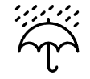

#  rain-check
## A web application for simply avoiding bad weather

rain-check is an easy to use web application which its primary goal is to avoid bad weather. This is done by fetching highly accurate minute-by-minute weather data based off a route that a user has selected. It will display a detailed summary of the weather along the way and will calculate for you the most optimal time to leave to be able to avoid as much rain as possible.

## Features 
* Mobile-friendly
* Send e-mail notifications
* See weekly forecasting
* Geolocation
* Three different transportation methods
* See if it recently rained in order to anticipate slippery roads and alerts for severe weather 


# Getting Started

### Here is how to get the project up and running on your local machine for development purposes:

### Prerequisites

Since the project implements its functionality using various APIs, you will need API keys for the following services: 

* [Dark Sky Weather API](https://darksky.net/dev)
* [GraphHopper Directions API](https://www.graphhopper.com/)
* [Bing Maps Locations API](https://docs.microsoft.com/en-us/bingmaps/rest-services/locations/)

You will also need:
* [Node and NPM](https://nodejs.org/en/)


### How to Install & Run


Firstly clone the repo:

```
git clone https://cseegit.essex.ac.uk/ce301_2019/ce301_moussoulides_a.git
```

Then to install all the required dependencies, on the root directory of the project and the  ``` client ``` folder type:

```
npm install
```


To be able to put your Dark Sky API key and setup your own email notifications, create a ```.env``` file in the root directory and put the following:
```
API_KEY=YOUR_API_KEY_HERE //Dark Sky API Key

GMAIL_NAME=YOUR_GMAIL_HERE

GMAIL_PASS=YOUR_GMAIL_PASS_HERE

NODE_TLS_REJECT_UNAUTHORIZED='0'
```
Then, on the beginning of the ```index.js``` file on the ```client``` directory, put your API keys here for GraphHopper and Bing Locations. This is the already existing sample provided in the code where you should put your API keys:

```
  let control = L.Routing.control({
 
  routeWhileDragging: false,
  draggableWaypoints : false,
  
  geocoder: L.Control.Geocoder.bing('YOUR API KEY HERE'), //API key for Bing
  router: L.Routing.graphHopper('YOUR API KEY HERE' , {  // API key for GraphHopper

    
    urlParameters: {
        vehicle: 'foot',  //default method
        details: 'edge_id',
        debug: true,
          
    } 
   
  })
}).addTo(mymap);
```
Lastly, when all the above steps are done, run the project with:
```
npm run server
```

And then visit ```localhost:5000``` in your favorite browser


# Demonstration and How to Use

Simply put your start point and end point in the text boxes and press enter, as shown below:


A route and weather summary, along with a basic weekly forecast will be shown below: 


The first graph will show you the intensity of rain throughout your journey for multiple departure times: 


The second graph will let you visualize the total rainfall of all the routes and calculate the best time to leave in order to avoid as much rain as possible:


# Built With
Server side:
* [Node.js Runtime Environment](https://nodejs.org/en/)
* [Express.js Web Framework](https://expressjs.com/)

Client Side:
* [JavaScript](https://www.javascript.com/)
* [Bootstrap CSS Framework](https://getbootstrap.com/)

APIs & Libraries:
* [Leaflet.js](https://leafletjs.com/)
* [Leaflet Routing Machine](https://www.liedman.net/leaflet-routing-machine/)
* [Dark Sky Weather API](https://darksky.net/dev)
* [GraphHopper Directions API](https://www.graphhopper.com/)
* [Bing Maps Locations API](https://docs.microsoft.com/en-us/bingmaps/rest-services/locations/)


## Authors

* **Antonis Moussoulides**


## Acknowledgments

* Many thanks to Dr. Daniel Karapetyan, Dr. Adrian Clark and Dr. Liu Zilong for their valuable feedback
* Credits to Per Liedman for the [lrm-graphhopper Script](https://www.liedman.net/leaflet-routing-machine/) and [Leaflet Routing Machine](https://www.liedman.net/leaflet-routing-machine/)
